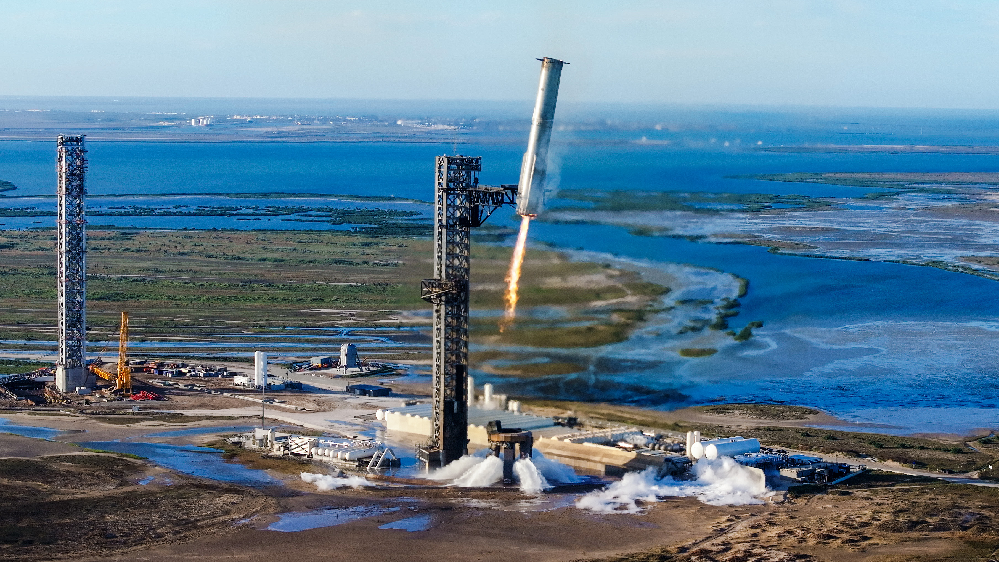

# `gfold-py` ***`neo`***
A fresh ***neo*** implementation of G-FOLD (**G**uidance algorithm for **F**uel **O**ptimal **L**arge **D**iverts) algorithm in `python` with `cvxpy`.

This is a fresh new start of the original project `gfold-py`(2022-2024).

*Booster caught by "Mechazilla". Starship Mission, 2024. (Credit: SpaceX)*

Copyright (C) 2022-present CuNO3.  
Licensed under the BSD 3-Clause License.

## Requirements
- Python 3.9
- cvxpy 1.3.2
- ~~cvxpygen (when generating C code) 0.2.3~~
*\*Will be back sometime in the future*

## References
["Lossless Convexification of Non-Convex Control Bound and Pointing Constraints of the Soft Landing Optimal Control Problem ."](https://doi.org/10.1109/TCST.2012.2237346)  

["Convex Programming Approach to Powered Descent Guidance for Mars Landing"](https://doi.org/10.2514/1.27553)

["Lossless Convexification of Powered-Descent Guidance with Non-Convex Thrust Bound and Pointing Constraints"](https://doi.org/10.1109/ACC.2011.5990959)

["Lossless convexification of control constraints for a class of nonlinear optimal control problems"](http://doi.org/10.1109/ACC.2012.6314722)

["Minimum-Landing-Error Powered-Descent Guidance for Mars Landing Using Convex Optimization"](http://doi.org/10.2514/1.47202)
